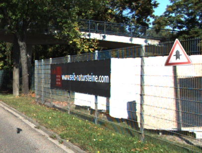

<h3 align="center">Dataset generator</h3>

This simple repository provides implementation of full-image dataset generator. This tool is able to create synthetic dataset for CNN single-shot detector (YOLO, SSD) training. In my study I used to create synthetic datasets of traffic signs.

## Dependencies

 - OpenCV 3.x and higher

## About the tool

Tool works on simple principle of placing objects to the images of background and can work in two different ways.

 - Using many real cropped objects (used for classifier training)

Cropped objects are placed to the images of background using Poisson blending.

 <b>Cropped traffic sign placed to the background (using poisson blending on the right)</b>: 

 - Using few transparent objects

Before transparent objects are placed into background, few effects are applied to synthetically modify appearance of the object.

 <b>All effects applied on the traffic sign separately (original in the top left corner)</b>: 

 <b>Then objects are placed into background on the random position</b>: 

